# 📄 Dokümantasyon ve Versiyon Takip Sistemi

**Bozankaya Teknoloji A.Ş.** mühendislik süreçlerinde kullanılan dosya ve belgelerin versiyonlarını takip etmek, farklarını analiz etmek, notlar ve ilişkiler ekleyerek anlamlandırmak, filtrelenmiş veri çıktıları oluşturmak amacıyla geliştirilmiştir.  
Bu sistem sayesinde manuel ve zaman alıcı belge kontrol süreçleri **otomatikleşir** ve mühendislik ekiplerinin iş akışı **hızlanır**.

---

## 🎯 Amaç
- Versiyonlanmış dosyaların satır veya hücre bazında farklarını tespit etmek  
- Fark raporlarını not ve ilişkiler ile zenginleştirmek  
- XML/Excel tabanlı proje verilerini filtreleyip tablo çıktısı almak  
- Kullanıcı ve işlem bazlı güvenli kayıt tutmak

---

## 🔖 Bilgilendirme / Proje Kodları
Şirketin kullandığı proje kısa adları ve kodlarının anlamlarını açıklar.  
> Bu bölüm, dosya adlandırma ve arama süreçlerinde kolaylık sağlar.

---

## 📁 Proje / Dosya Yönetimi
- **Dosya Yükleme:** Versiyonlanmış projelerinizi sisteme yükleyin  
- **Detay Görüntüleme:** Yüklenme tarihi, dosya ID’si, karşılaştırma geçmişi, eklenmiş notlar  
- **Geçmiş Takibi:** Tüm versiyonlar arası ilişkiyi tek ekranda izleyin

---

## 🧩 Kod Bloğu Ekleme & XML Birleştirme
- Seçili projeye kod bloğu ekleyin ve birleştirme işlemini başlatın  
- İki farklı XML dosyasını tek bir dosyada birleştirin  
- Sonuç dosyasını indirip Codesys ortamına **Import** ederek kullanın

---

## 🔍 Versiyon Karşılaştırma (Diff)
- İki XML dosyasını satır bazında karşılaştırır  
- **Silinen satırlar** kırmızı, **eklenen satırlar** yeşil renkle gösterilir  
- Karşılaştırma sonuçları raporlanır ve not eklenebilir

---

## 📊 Excel Karşılaştırma
- Dosya seç veya sürükle-bırak yöntemiyle yükleme  
- İki Excel tablosu arasındaki farklılıkların listelenmesi  

---

## 🗂 Karşılaştırma Raporları
- Tüm geçmiş karşılaştırma kayıtları listelenir  
- Kullanıcı adı, tarih, rapor içeriği ve dosya bilgileri görüntülenir

---

## 📝 Notlar & İlişkiler
- Notlar görüntülenebilir, ilişkiler eklenip düzenlenebilir  
- Notun görünürlük yetkisi belirlenebilir  
- Admin tüm notları görüntüleyip filtreleyebilir  
- **Not → Rapor → Dosya** zinciriyle izlenebilirlik sağlanır

---

## 📑 Tablo Oluşturma / Filtreleme
- Proje dosyasındaki sinyalleri (ID, isim, offset, min/max, resolution vb.) görüntüleyip Excel olarak indirin  
- Belirli sinyal isimlerini filtreleyerek yalnızca ilgili verileri içeren tablolar oluşturun

---

## 👤 Kullanıcı Yönetimi (Admin)
- Kullanıcı yetkilerini düzenleyin  
- Yeni kullanıcı ekleyin veya mevcut kullanıcıları güncelleyin  

---

## 📌 Örnek Kullanım Akışı
1. **Versiyon 1** dosyasını yükleyin  
2. **Güncellenmiş Versiyon 2** dosyasını yükleyin  
3. İki dosyayı karşılaştırın  
4. Rapor üzerine açıklayıcı not ekleyin  
5. Not ile ilgili doküman veya sistem bağlantısı kurun  
6. Filtreleme ekranından sinyal verilerini Excel olarak indirin  
7. Gerekirse belirli bir sinyal adını filtreleyin  
8. İki farklı Excel dosyasını karşılaştırın  
9. Projeye kod bloğu ekleyip XML’i birleştirin ve Codesys’e aktarın

---

## 🔒 Güvenlik & Takip
- Tüm işlemler giriş yapan kullanıcı ile ilişkilendirilerek loglanır  
- Yetkili olmayan kullanıcılar verilere erişemez  
- Oturum süresi bitince yetkili alanlar kapanır ve **Giriş Yap** ekranına yönlendirilir  

---

## 🛠 Teknolojiler

| Katman | Teknoloji / Kütüphane | Amaç |
|--------|----------------------|------|
| **Backend** | Python | Sunucu tarafı geliştirme dili |
| | Flask 3.1.1 | Backend web framework |
| | Flask-CORS | Cross-Origin Resource Sharing yapılandırması |
| | Flask-JWT-Extended | JWT tabanlı kimlik doğrulama |
| | Flask-SQLAlchemy | ORM (Object Relational Mapping) |
| | psycopg2-binary | PostgreSQL bağlantısı |
| | pandas / openpyxl | Excel verisi işleme |
| | lxml / html5lib | XML/HTML parsing |
| **Veritabanı** | PostgreSQL | İlişkisel veritabanı |
| **Frontend** | React 19 | Kullanıcı arayüzü framework |
| | React Router DOM | Sayfa yönlendirme |
| | Axios | HTTP istekleri |
| | React Toastify | Bildirim sistemi |
| | XLSX | Excel dosya işleme |
| | File Saver | Dosya indirme |
| | Testing Library (React) | Frontend testleri |

---

## 📸 Ekran Görüntüleri

### 1. Giriş ve Tanıtım
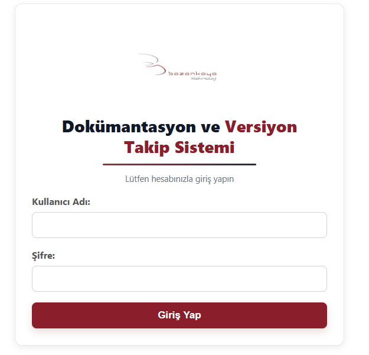
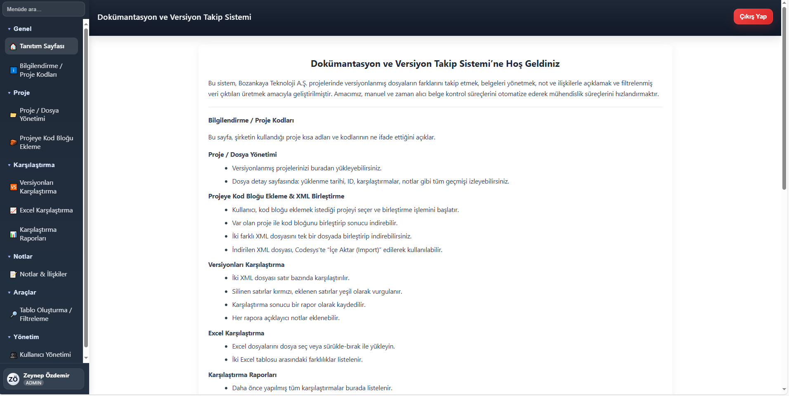

---

### 2. Bilgilendirme ve Dosya Yönetimi
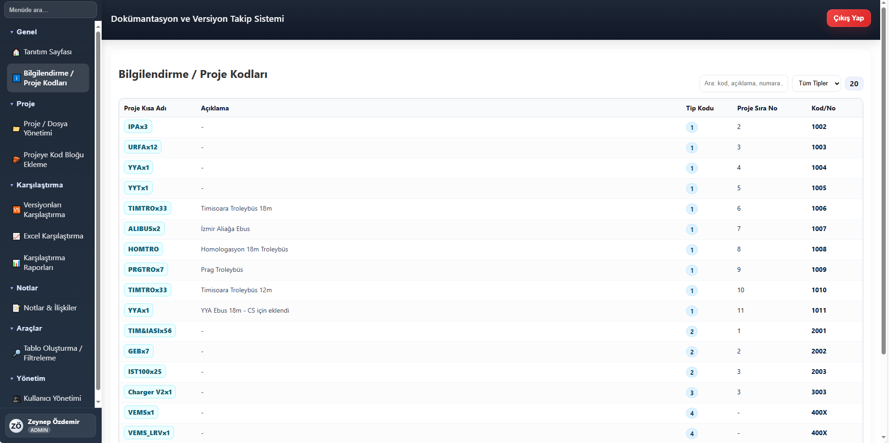
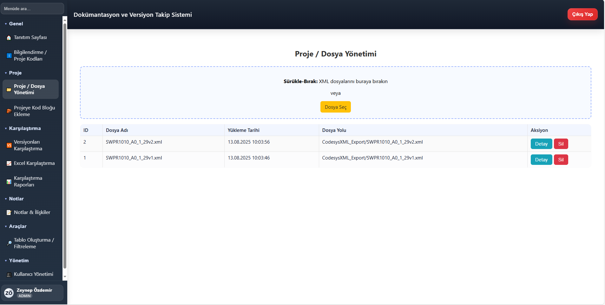
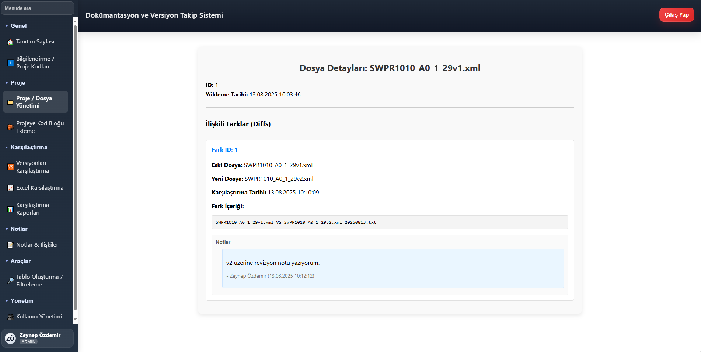

---

### 3. Kod Bloğu Ekleme
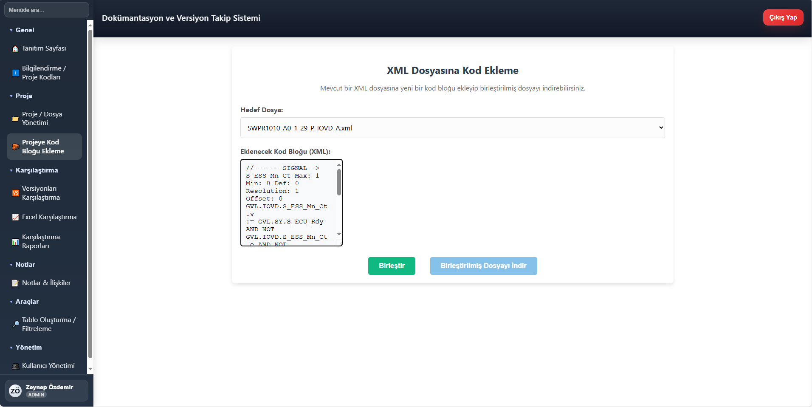
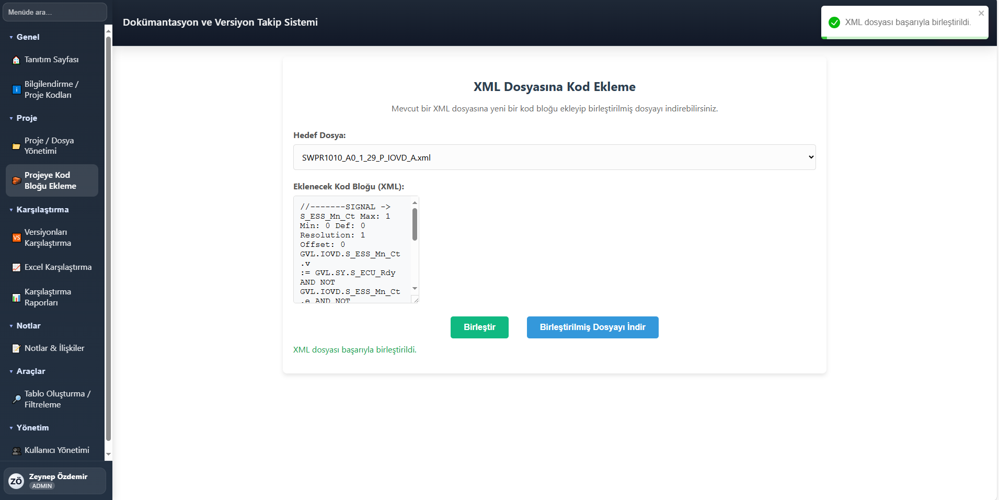

---

### 4. Versiyon ve Excel Karşılaştırma
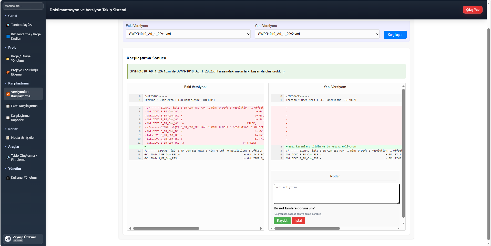
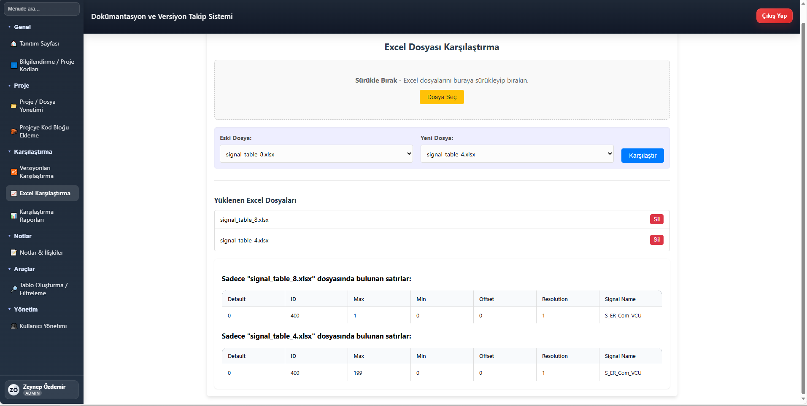

---

### 5. Karşılaştırma Raporları ve Notlar
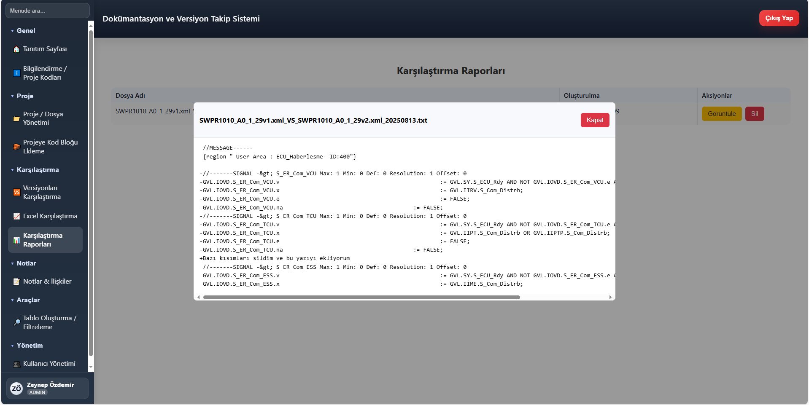
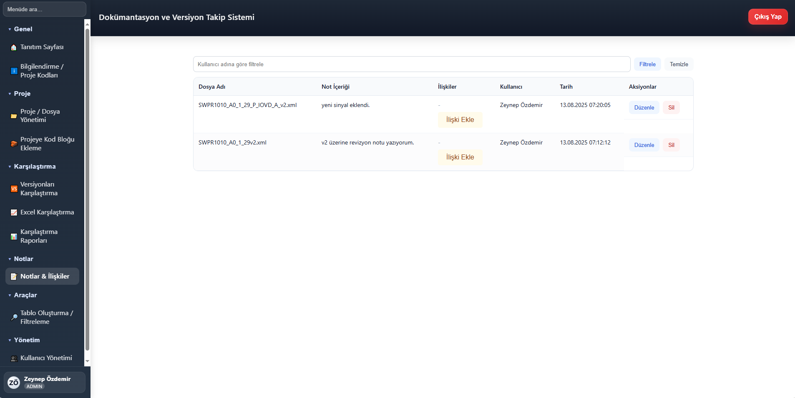

---

### 6. Tablo Oluşturma ve Filtreleme
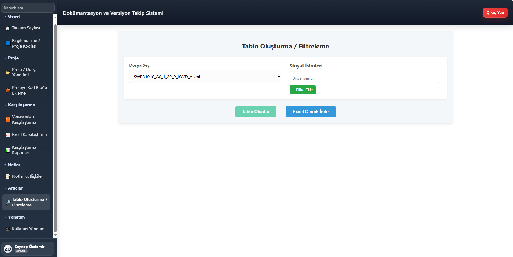

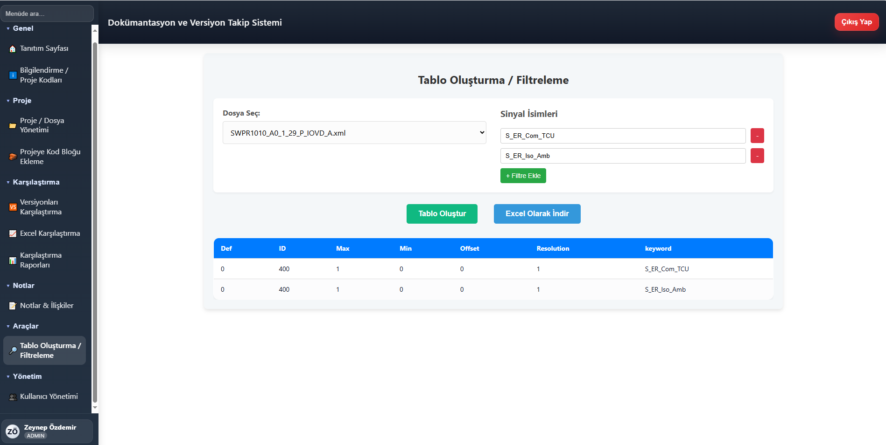

---

### 7. Kullanıcı Yönetimi
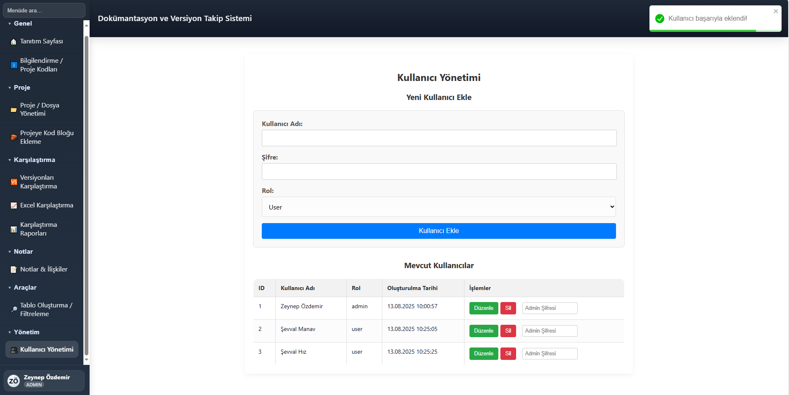

## 🗺️ ER Diyagramı

[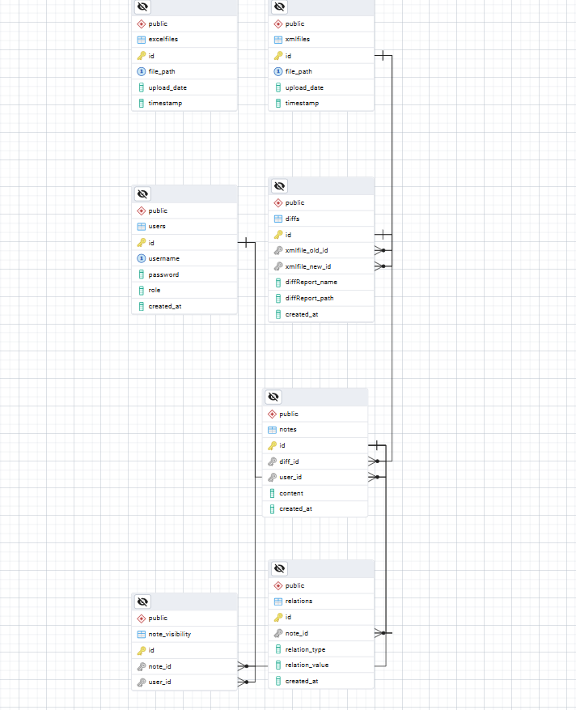](assets/screenshots/codesys_db_ER.png)